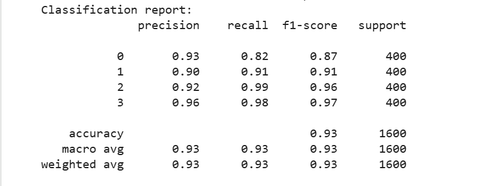
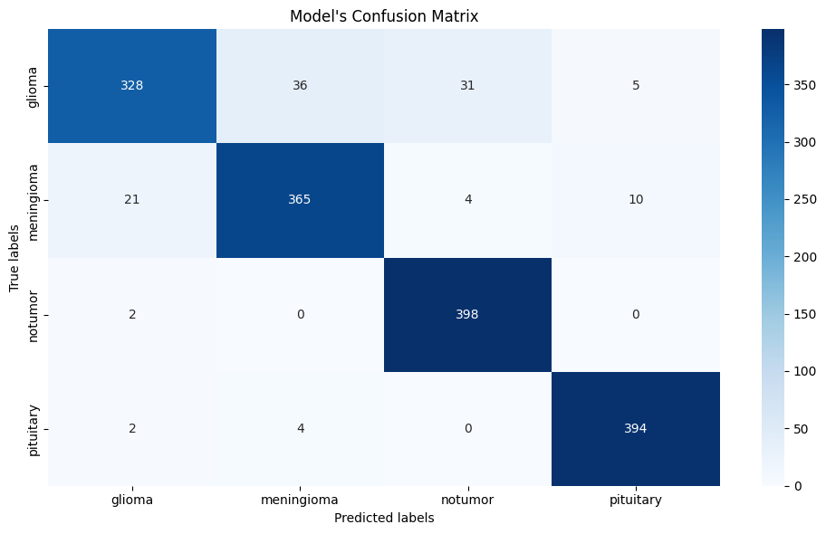
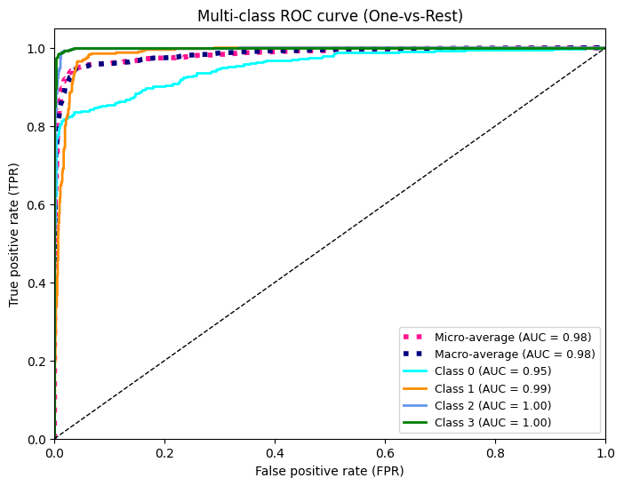

# 🧠 Brain Tumor Detection from MRI Images

A web application that uses a **Convolutional Neural Network (CNN)** with transfer learning (**VGG16**) to classify brain MRI scans and detect the presence and type of brain tumor.


---

## 📋 Introduction

Brain tumors are among the most critical conditions to diagnose quickly and accurately, as early detection has a major impact on treatment outcomes. Manual analysis of MRI scans is time-consuming and requires expert radiologists, which isn't always available.

This project explores how deep learning, specifically **transfer learning with VGG16**, can be used to automatically classify brain MRI images into four categories: **glioma**, **meningioma**, **pituitary tumor**, and **no tumor**. The trained model is deployed behind a simple **Flask web application**, allowing a user to upload an MRI scan and instantly receive a predicted diagnosis class.

To ensure the model generalizes well and isn't simply memorizing the training data, the dataset was split into **train, validation, and test sets**. The validation set was used during training (with early stopping) to monitor generalization and select the best-performing weights, while the test set was kept fully separate for final, unbiased evaluation.

## ✨ Features

- 🖼️ Upload MRI images directly through the browser
- 🧠 CNN (VGG16 transfer learning) trained to classify brain tumors
- ⚡ Fast, real-time predictions
- 🌐 Simple, clean web interface (Flask + HTML)
- 📓 Includes Jupyter notebook documenting the full training pipeline
- ✅ Train / Validation / Test split for reliable performance evaluation

## 🏷️ Tumor Classes

The model classifies MRI scans into the following four categories:

- **Glioma**
- **Meningioma**
- **Pituitary Tumor**
- **No Tumor**

## 🛠️ Tech Stack

| Component       | Technology                  |
|-----------------|------------------------------|
| Backend         | Flask (Python)               |
| Model           | TensorFlow / Keras (VGG16)   |
| Frontend        | HTML, CSS                    |
| Model Training  | Jupyter Notebook              |

## 📂 Project Structure

```
BrainTumor/
├
|── assets
|   ├── Classification_Report.png
│   ├── Confusion_Matrix.png
│   └── Roc_Curve.png
|── models/
│   └── model.h5                          # Trained CNN model
├── Notebook/
│   └── BrainTumorPrediction.ipynb        # Model training notebook
├── sample MRI images/                    # Example MRI scans for testing
│   ├── glioma.jfif
│   ├── meningioma.jpg
│   ├── NoTumor.jfif
│   ├── petuitary1.jpg
│   └── petuitary2.jpg
├── templates/
│   └── index.html                        # Web app frontend
├── uploads/                               # Stores user-uploaded images (runtime)
├── main.py                                # Flask application entry point
├── requirements.txt                       # Python dependencies
└── README.md
```

## 🧪 Model Training & Dataset

- **Dataset:** Brain Tumor MRI
- **Input size:** 128 × 128 pixels
- **Base architecture:** VGG16 (pre-trained on ImageNet, used as a feature extractor) with custom dense classification layers
- **Data split:** Train / Validation / Test

Full training steps, preprocessing, and evaluation can be found in:

```
Notebook/BrainTumorPrediction.ipynb
```

## 📊 Evaluation Metrics

The model was evaluated on the held-out **test set** using the following metrics:

### Classification Report

Precision, Recall, and F1-score were computed per class:

$$
\text{Precision} = \frac{TP}{TP + FP}, \quad
\text{Recall} = \frac{TP}{TP + FN}, \quad
F_1 = 2 \cdot \frac{\text{Precision} \cdot \text{Recall}}{\text{Precision} + \text{Recall}}
$$

The model reached an overall **test accuracy of 93%**, with strong and consistent performance across all four classes:



### Confusion Matrix

The confusion matrix shows predicted vs. true labels across all classes. The model performs especially well on **no tumor** and **pituitary** cases, with most misclassifications occurring between **glioma** and **meningioma**, which are visually similar tumor types:



### ROC Curve & AUC

The ROC curve evaluates the model's ability to discriminate between classes:

$$
TPR = \frac{TP}{TP + FN}, \quad FPR = \frac{FP}{FP + TN}
$$

The model achieved a **macro-average AUC of 0.98**, confirming excellent overall discriminative ability across all tumor classes:



## 📸 Sample Predictions

| Input MRI | Predicted Class | Result |
|-----------|-----------------|--------|
| `glioma.jfif` | Glioma | ✅ Correct |
| `meningioma.jpg` | Meningioma | ✅ Correct |
| `NoTumor.jfif` | No Tumor | ✅ Correct |
| `petuitary1.jpg` | Pituitary Tumor | ✅ Correct |
| `petuitary2.jpg` | Pituitary Tumor | ❌ Misclassified |

> Out of the 5 sample MRI images tested, **4 out of 5 were predicted correctly**. The only misclassification occurred on `petuitary2.jpg`, which the model failed to recognize correctly.

## 🚀 Installation

1. **Install Git LFS (required to download the model)**
   ```bash
   git lfs install
   ```
2. **Clone the repository**
   ```bash
   git clone https://github.com/zakariae-67/brain-tumor-detection.git
   cd brain-tumor-detection
   ```

3. **Create a virtual environment**
   ```bash
   python -m venv .venv
   .venv\Scripts\activate      # Windows
   source .venv/bin/activate   # macOS/Linux
   ```

4. **Install dependencies**
   ```bash
   pip install -r requirements.txt
   ```

## ▶️ Usage

1. **Run the Flask app**
   ```bash
   python main.py
   ```

2. **Open your browser** and go to:
   ```
   http://127.0.0.1:5000
   ```

3. **Upload an MRI image** using the web interface and view the prediction result.

## ⚠️ Disclaimer

This project is intended for **educational and research purposes only**. It is **not** a certified medical diagnostic tool and should not be used as a substitute for professional medical advice, diagnosis, or treatment. Always consult a qualified healthcare provider for medical concerns.


## 📄 License

This project is licensed under the MIT License — see the [LICENSE](LICENSE) file for details.

## 👤 Author

**Moussaoui Zakariae**

[](https://github.com/zakariae-67)
[](https://www.linkedin.com/in/zakariae-moussaoui)
[](https://x.com/M_Dexter_1)